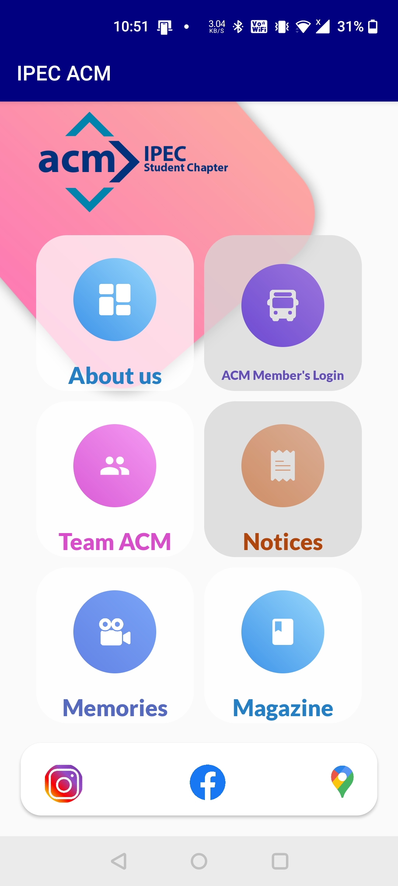
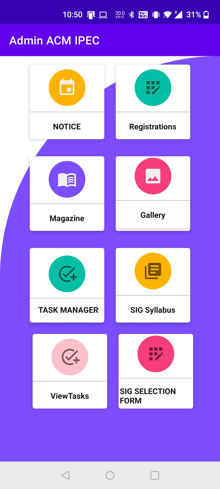
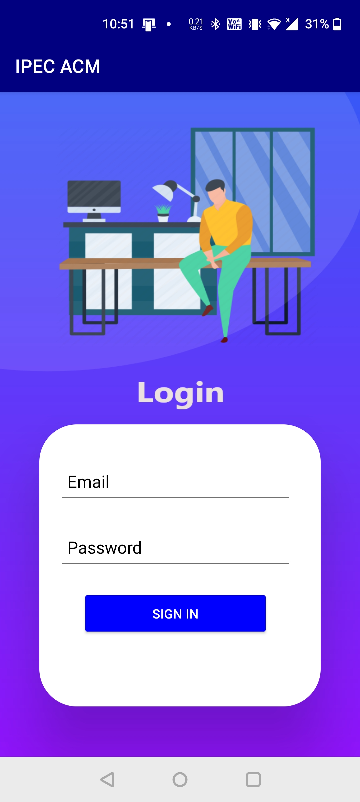
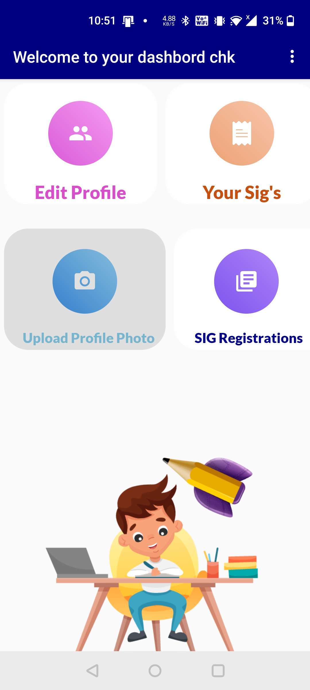

# Student-Portal-App
   

Built a student Portal App for college society.
Used Java and Firebase. 
Students can view their assignments, notices, can select their respective Subjects and many more.
